# 第三方IM简介

## 腾讯[云通信](https://www.qcloud.com/product/im.html)
- 免费
- 架构介绍
云通信提供单聊、群聊、资料托管、关系链托管、帐号托管全方位解决方案，并提供完善的APP接入、后台管理接口。  
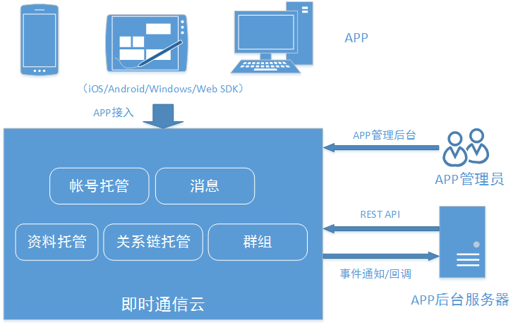
- 账户体系
  1. 独立模式：用户帐号信息由开发者保存，用户身份验证（比如注册与验密）也由开发者负责；
  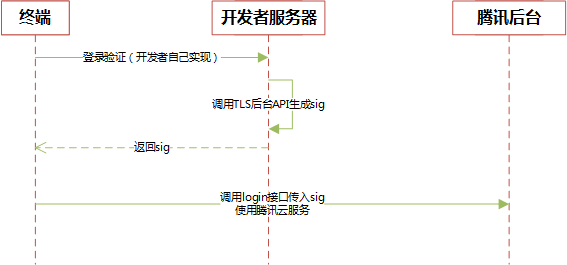
  2. 托管模式：由腾讯为开发者提供帐号的密码注册、存储和密码验证，以及第三方openid和token的托管验证服务
- [产品概述](https://www.qcloud.com/doc/product/269/%E4%BA%A7%E5%93%81%E6%A6%82%E8%BF%B0)
- [功能介绍](https://www.qcloud.com/doc/product/269/%E5%8A%9F%E8%83%BD%E4%BB%8B%E7%BB%8D)
- [接入服务系统](https://www.qcloud.com/doc/product/269/%E6%8E%A5%E5%85%A5%E6%9C%8D%E5%8A%A1%E7%B3%BB%E7%BB%9F)
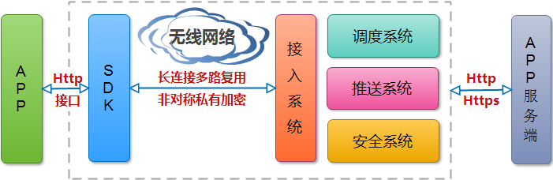  
仅有demo界面需开发人员自己设计开发。

## 阿里[云旺OpenIm](http://baichuan.taobao.com/doc2/detail?spm=a3c0d.7662649.4.15.tGeP6f&treeId=41&articleId=102626&docType=1)
- 案例：旺信，手机淘宝，去啊，淘点点，橙牛，途虎养车，河狸家，识货，车猫，PBA
- 免费
- [产品概述](http://baichuan.taobao.com/doc2/detail?spm=a3c0d.7662649.4.16.tGeP6f&treeId=41&articleId=102626&docType=1)
- 云旺（OpenIM）服务端客户端交互图
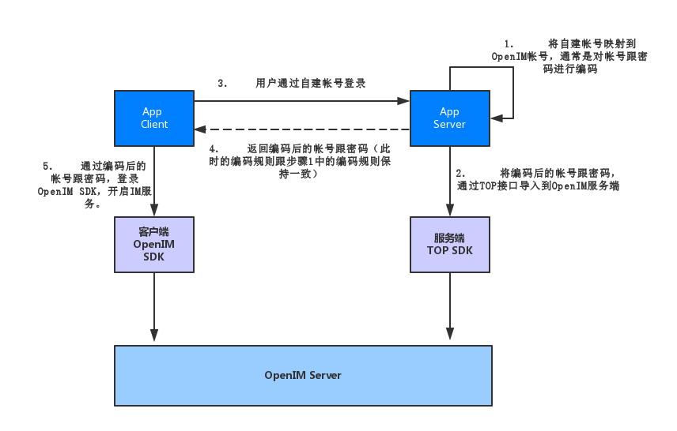
- [常见问题](http://baichuan.taobao.com/doc2/detail.htm?spm=a3c0d.7629140.0.0.QQF158&treeId=41&articleId=103786&docType=1)
完全免费。
具有集成UI，可快速开发。  
客户端会保存所有历史聊天记录，永不失效。   
服务端会保存最近一个月的聊天记录，如果你换了手机，那么可以从服务端漫游最近一个月的聊天记录。  
群聊的人数上限是2000  
目前对群个数没有限制，可以无限制创建  
不提供，需要开发者自己维护。因为好友关系等数据是APP的核心数据，OpenIM出于数据安全考虑，不介入到APP的核心数据。  推荐集成带UI的版本，原因是开发成本低，定制能力强，基本上你看到的界面都可以定制。  
对于特殊业务，可以自己实现UI，集成IMCore，IMKit也是使用依赖IMCore的。  

## 阿里[悟空](https://imwukong.com/)
- 案例：大姨妈，捉急，钉钉，phpwind，人和  
- 收费： 阿里悟空当前是不收费的，未来会有收费计划，定价将会很有竞争力  
- [产品概述](https://imwukong.com/#doc/doc/common/index.htm)  
- 用户体系
  阿里悟空支持免导入登录方式，开发者可以方便的将已有的用户体系与阿里悟空实现对接，而无需将现有用户信息提前导入阿里悟空。   
  阿里悟空使用 OpenID（long 型）来唯一标识一个用户。在联合鉴权机制下，OpenID 的分配及维护由开发者自行维护，需要保证其确定且唯一（通常，开发者将应用原本的 userID 进行简单的映射或者直接使用 userID 作为传递给悟空的 OpenId 即可）。  
  免导入登录的步骤如下：
    - 开发者客户端根据用户名和密码登录开发者服务器
    - 开发者服务器生成针对用户的签名signature（signature 的生成算法可以参考悟空Demo服务端部署指南 中的源代码示例）
    - 开发者服务器返回 signature、domain、appkey、timestamp 等数据给客户端
    - 开发者客户端调用阿里悟空的 SDK 接口完成登录鉴权
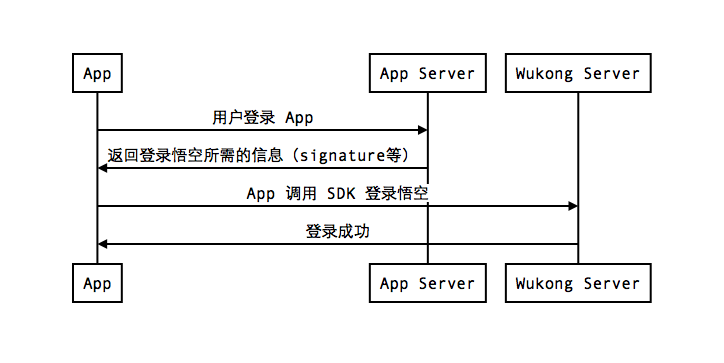

- 整体架构:  
悟空Demo包含客户端和服务端两部分：其中服务端提供了用户鉴权的基本方法；    
客户端调用服务端的用户鉴权，再将结果发送到阿里悟空平台完成App鉴权和用户登录，登录后就可以通过阿里悟空平台跟其他用户之间收发即时消息。   
悟空Demo的主要目的是向您展示阿里悟空平台联合鉴权模式的使用，供您在开发即时通讯功能时作参考。   
悟空Demo的流程图：  
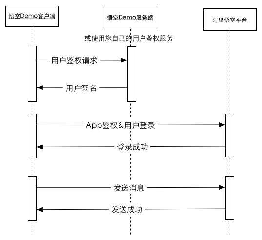  
- [常见问题](https://imwukong.com/#faq)  
当前阿里悟空的聊天消息是永久存储的。  
阿里悟空当前还没有提供 UI 组件，但是开发者可以参考我们的 Demo  
群成员人数是有上限的，单个群成员上限为 1500  
会话个数，群个数都是没有上限的。  

## 网易[云信](http://netease.im/)
- [收费方式](http://netease.im/price)  
按当月日活跃人数峰值计费
- [产品概述](https://imwukong.com/#doc/doc/android/quickstart.htm)

## [融云](http://rongcloud.cn/)
- 案例：悦跑圈，虎扑跑步，有邻，脸萌，优信二手车，易车二手车
- [收费方式](http://rongcloud.cn/pricing/pay)  
收费服务：
  - 服务端实时消息路由: 将聊天消息数据实时同步到您的应用服务器，可实现对用户之间的消息进行处理，或新老系统的消息对接功能。
  - 广播消息和推送：向应用中所有或部分用户发送消息，实现将应用的活动预告、内容动态精准及时的发送给用户，满足您的运营需求。
  - 在线状态订阅：将应用中用户在线状态实时同步到您的应用服务器，实现对用户状态（在线、离线、登出）的逻辑处理。
  - 历史消息云存储：提供从服务器获取历史消息功能，可实现用户聊天消息多端同步漫游，历史消息最多保存 6 个月。
  - 多设备消息同步
  - 专属服务器：运营过程中，可能会由于大型推广活动、节日促销等各种运营需求或突发事件，导致用户量出现大幅激增，这时候专属服务器可以保障您的服务依然处在稳定状态，持续为您的用户提供服务。
  - 海外数据中心
  - 短信服务
  - 游戏sdk
  - 公众服务第三方服务插件：通过融云应用公众服务接入“美洽客服”、“智齿客服”等第三方服务插件，帮助您快速拓展业务能力，满足客户实际需求。
- 架构介绍  
  融云提供的即时消息传输服务，不在 App 之外建立并行的用户体系，不需要同步用户账户，不影响 App 现有的系统架构与帐号体系，与现有业务体系能够实现完美融合。   
  融云的架构设计上具有如下特点：
  - 无需改变现有 App 的架构，直接嵌入现有代码框架中；
  - 无需改变现有 App Server 的架构，独立部署一份用于用户授权的 Service 即可；
  - 专注于提供通讯能力，使用私有的二进制通信协议，消息轻量、有序、不丢消息；
  - 安全的身份认证和授权方式，无需担心 SDK 能力滥用（盗用身份的垃圾消息、垃圾群发）问题。
  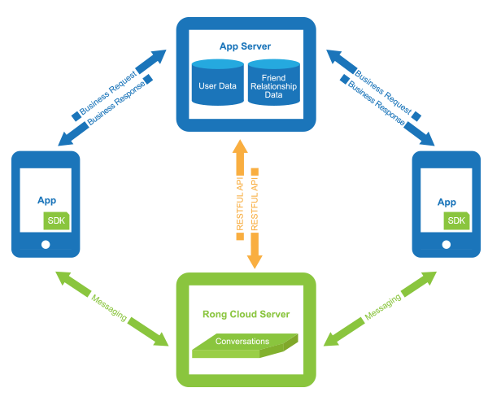  
  蓝色为您的应用（App）和应用服务器（App Server），用户数据（User Data）和用户好友消息（Friend Relationship Data）保存在您的应用服务器上，融云不需要同步 App 的用户系统和好友关系；绿色为融云服务器（RongCloud Server）和融云 SDK，支持快速集成和平滑迁移。  
  蓝色箭头表示您自己的业务数据经由您自己的应用服务器；绿色箭头表示消息需要经过融云服务器转发（IM 的离线、通知等逻辑决定了消息必须经由服务器进行一次转发）；橙色箭头表示您的应用服务器只需要和融云服务器进行身份授权，不需要您提交详细用户资料。

- 集成流程  
  融云的集成流程如下图所示，其中几个关键环节需要注意：
  1. App 服务端换取 Token 流程，可以参考 Server 开发文档 - 获取 Token 方法
  2. 客户端集成流程，可以参考 Android 开发指南 或者 iOS 开发指南
  3. UI 界面自定义，可以参考 Android 开发指南 - UI 自定义 或者 iOS 开发指南 - UI 自定义  
  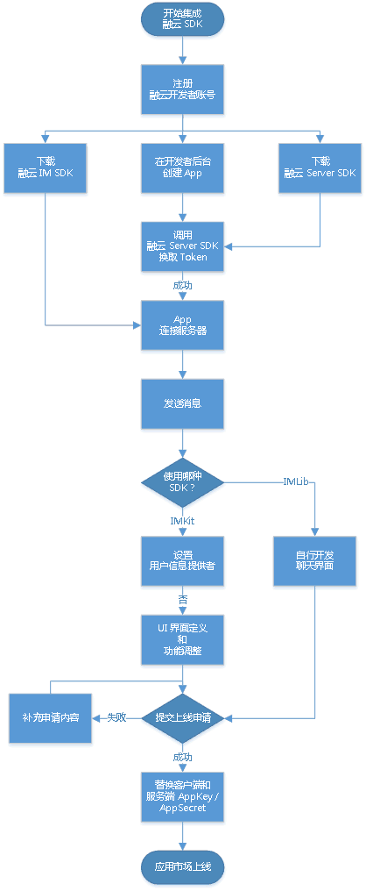

- SDK体系架构介绍：  
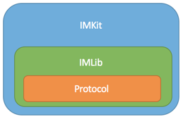
  - IMKit 的功能主要是封装各种界面对象，服务于开发者快速实现自己的产品，主要特点是是支持快速集成，支持丰富的界面定制功能。
  - IMLib 的功能是提供基本通信能力库，封装了通信能力和 Conversation，Message 等各种对象，服务于需要根据自己的产品去自己实现界面的开发者。主要特点是封装清晰，轻量，便于使用。
  - Protocol 是融云的核心协议栈，使用融云自定义的私有二进制协议。主要特点是是轻量化，有序可靠，不丢消息。Protocol 部分使用 Native 语言开发，在 Android 和 iOS 平台上保证业务一致性，便于开发者商用化自己的产品。
- [产品概述](http://www.rongcloud.cn/docs/)
- [常见问题]()  
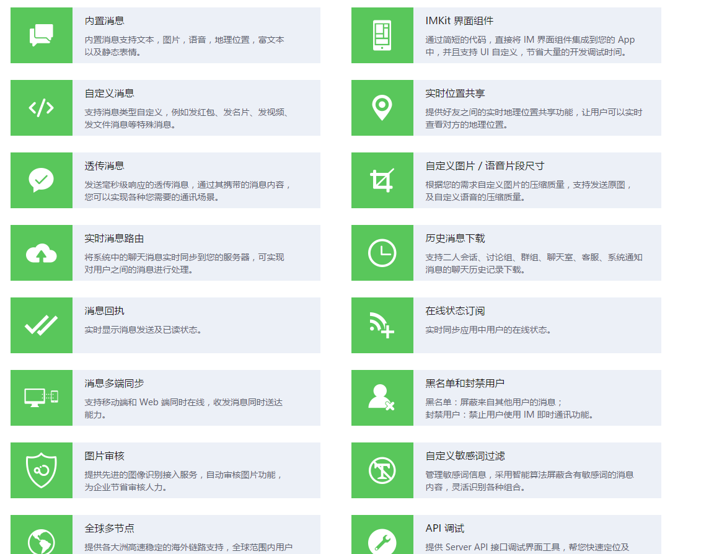

## [环信](http://www.easemob.com/)
- 案例：妈妈网，节操精选，车友会，优听Radio，蜻蜓fm，微财讯，宝宝树课信
- [收费方式](http://www.easemob.com/pricing)
  - 日活30万以下永久免费
  - 按日活用户数计费(30万以上), 每10万日活用户5000元每月
  - IM即时通讯云增值服务(回调功能，消息实时路由, VIP集群服务, 反垃圾服务, 集成测试VIP服务, VIP年度高级服务包)

- [产品概述](http://docs.easemob.com/im/start)
- 集成概述
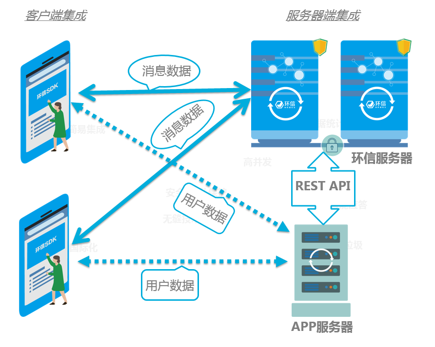
- 用户体系：
> 用户管理REST API提供了一个创建环信账号的REST方法。这个方法很简单，只需要提供账号ID和密码2个参数，就可以创建一个环信账号。对一个已经上线，已经有很多现有用户的APP来说，要集成环信，只需要写一个脚本，循环调用创建环信用户的REST方法即可。

- 好友体系：
> 环信提供好友体系，但不是必须使用的，仅在需要控制消息发送权限时才启动。APP需要将现有APP的好友关系导入到环信的好友体系中，这样环信才有足够的信息去控制谁可以给谁发消息。好友列表管理REST API提供了一个修改环信账号好友体系的REST方法。对一个已经上线，已经有很多现有用户的APP来说，只需要写一个脚本，循环调用修改环信账号好友体系的REST方法即可。

- 环信聊天记录存储：
> A发送消息到环信服务器的同时，SDK会保存这条消息到本地数据库（SDK内部创建数据库，不允许直接操作）中，环信服务器在推送消息到B的同时也会在服务器记录下来（消息历史记录只会保留14天），B收到消息后，SDK会将这条消息存储到本地数据库   
注：客户端并未提供去服务器获取聊天记录的接口，所以，如果换了设备或者清空了数据，聊天记录都不会存在，如果有需求要从服务器拉去聊天记录，可以在自己服务器处理

- SDK介绍
环信SDK为用户开发IM相关的应用提供的一套完善的开发框架。 包括以下几个部分：
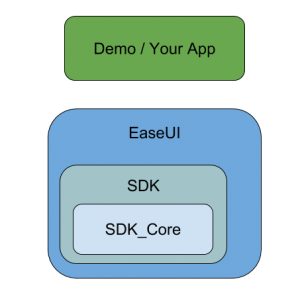
    - SDK_Core为核心的消息同步协议实现，完成与服务器之间的信息交换。
    - SDK是基于核心协议实现的完整的IM功能，实现了不同类型消息的收发，会话管理，群组，好友，聊天室等功能。
    - EaseUI是一组IM相关的UI控件，旨在帮助开发者快速集成环信sdk。
    开发者可以基于EaseUI或者环信SDK开发自己的应用，前者因为把消息的发送接送等功能封装到了内部，集成时开发者不需要太关心消息是怎么发送、怎么接收等逻辑，EaseUI文档点击点击这里。

- [常见问题](http://docs.easemob.com/im/500help)
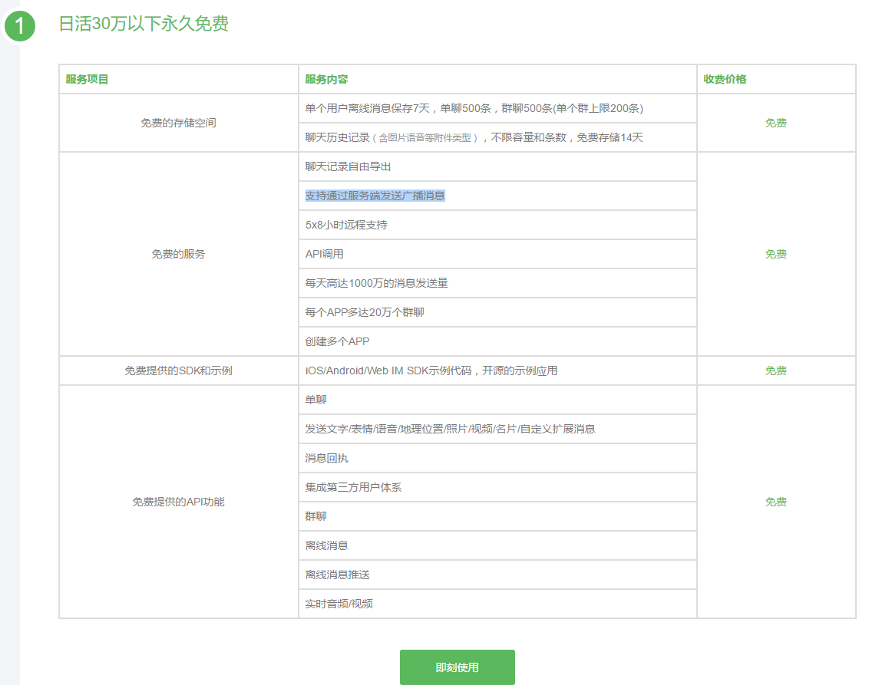  

## [LeanCloud](https://leancloud.cn/)
- 功能特性：
  LeanCloud 实时通信服务的特性主要有:
    - 与账户系统解耦合: 任何终端用户要加入聊天，只需要提供一个唯一标识自己的 clientId 即可，这样可以尽量避免自有账户系统的应用数据暴露，也可以促使通信服务专注做好底层的「信使」角色；
    - 多账号登录: 支持单个设备多个账号、单个账号多个设备同时登录，实时消息同步到所有设备。
    - 完整的聊天功能: 支持单聊、群聊、聊天室等不同聊天形式，并且具备完善的群组管理功能。
    - 支持富媒体、自定义类型消息: 支持文本、图片、音频、视频和地理位置等多种格式的富媒体消息，并且开发者还可方便地自定义扩展。
    - 离线消息推送: 消息在对方离线时，会自动通过 消息推送 来及时送达对方，并且推送的消息文本可以由开发者自己控制。
    - 敏感词过滤: 实时消息中出现的敏感词，会自动被过滤掉；对于部分 VIP 客户，我们还允许自定义仅属于自己应用的敏感词列表。
    - 聊天记录保存在云端: 聊天记录自动保存在云端，允许开发者自由获取。
    - 第三方操作鉴权机制: 为了保证信道的安全，也给开发者最大的控制自由，我们提供了操作鉴权的机制：开发者使用自己的服务器来充当鉴权服务器，对消息流向进行「许可控制」。对于消息路由过程中的重要操作（譬如登录、开启对话、邀请加入群组、从群组踢出某人等），实时消息 SDK 在发送请求之前，会先到鉴权服务器获得操作签名，LeanCloud 云端会验证签名有效性并完全按照鉴权结果来对操作放行或拒绝。
    - 系统账号、机器人 Hook 和公众号后台: 支持系统中的小助手、机器人和公众号等场景，方便用户将实时通信系统和自己已有的系统无缝集成，支持二次开发机器人和消息后台。
- [产品概述](https://leancloud.cn/docs/start.html)
- [收费方式](https://leancloud.cn/pricing.html)
- [常见问题](https://leancloud.cn/docs/faq.html)
